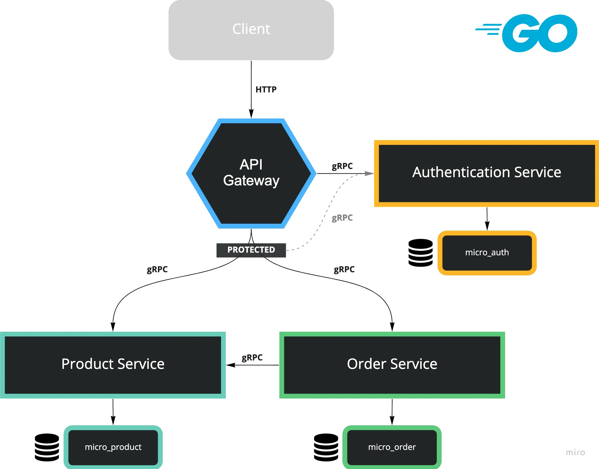
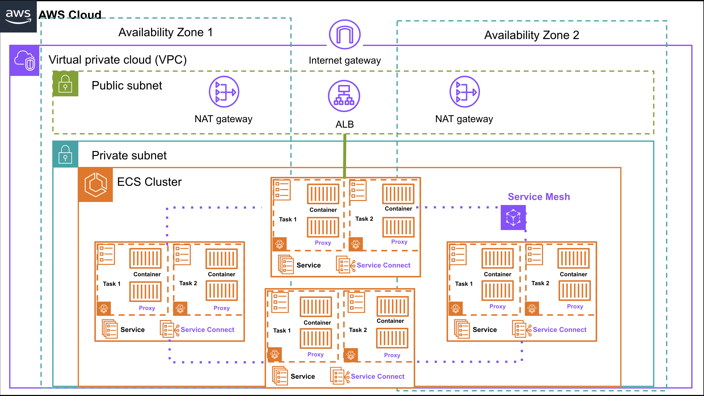

# Cloud-native Microservices: Orchestrating AWS ECS Fargate with Terraform


## Description
Explore the power of cloud-native architectures with a practical dive into building microservices using AWS ECS Fargate and Terraform. This tech talk combines hands-on examples with a theoretical overview of essential cloud services like VPCs, ALBs, EC2, Route 53 and also core concepts of security and networking in AWS.
## Repositories

- https://github.com/ErwinSalas/go-grpc-product-svc - Product SVC (gRPC)
- https://github.com/ErwinSalas/go-grpc-order-svc - Order SVC (gRPC)
- https://github.com/ErwinSalas/go-grpc-auth-svc - Authentication SVC (gRPC)
- https://github.com/ErwinSalas/go-grpc-api-gateway - API Gateway (HTTP)
- https://github.com/ErwinSalas/terraform-ecs-microservice- Terraform scripts bootstrap all the microservices

## Installation
### Terraform
#### MAC
First, install the HashiCorp tap, a repository of all our Homebrew packages.
```bash
brew tap hashicorp/tap
```
Now, install Terraform with hashicorp/tap/terraform.
```bash
brew install hashicorp/tap/terraform
```

#### Windows 
Chocolatey is a free and open-source package management system for Windows. Install the Terraform package from the command-line.
```bash
choco install terraform
```
#### Ubuntu

```bash
wget -O- https://apt.releases.hashicorp.com/gpg | sudo gpg --dearmor -o /usr/share/keyrings/hashicorp-archive-keyring.gpg
```
```bash
echo "deb [signed-by=/usr/share/keyrings/hashicorp-archive-keyring.gpg] https://apt.releases.hashicorp.com $(lsb_release -cs) main" | sudo tee /etc/apt/sources.list.d/hashicorp.list
```
```bash
sudo apt update && sudo apt install terraform
```
### AWS CLI
```bash
curl "https://awscli.amazonaws.com/AWSCLIV2.pkg" -o "AWSCLIV2.pkg"
sudo installer -pkg AWSCLIV2.pkg -target /
```
## Deploying infrastructure

```bash
# development
$ terraform plan
$ terraform apply
```


## Services Architecture
The microservice architecture consists of:

* Auth (gRPC)
* Orders (gRPC)
* Products (gRPC)
* API (REST)


 

## Cloud Architecture
The architecture consists of:

1. Internet Gateway: Routes external traffic.
2. ALB (Application Load Balancer): Routes traffic to the API service.
3. Private Subnet: Hosts all ECS services and AWS App Mesh for Service Connect.
4. Public Subnet: Hosts NAT gateways and Load Balancer.
5. ECS Cluster: Contains the following services:
    * Auth
    * Orders
    * Products
    * API

AWS Service Connect is used to facilitate service-to-service communication within the private subnet.





